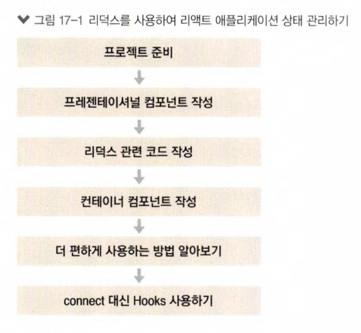

# react_redux_tutorial

- Redux

  - 상태 관리 라이브러리
  - 상태 업데이트에 관한 로직을 모듈로 따로 분리하여 컴포넌트 파일과 별개로 관리할 수 었으므로 코드를 유지 보수하는데 도옴
  - 여러 컴포넌트에서 동일한 상태를 공유해야 할 때 매우 유용하며, 실제 업데이트가 필요한 컴포넌트만 리렌더링되도록 쉽게 최적화
     
    
      

  - [x] [UI](./src/components/)
  - [x] [Redux](./src/modules/)
  - [x] [Container_Component](./src/containers/)

## Getting Started with Create React App

This project was bootstrapped with [Create React App](https://github.com/facebook/create-react-app).

## Available Scripts

In the project directory, you can run:

### `yarn start`

Runs the app in the development mode.\
Open [http://localhost:3000](http://localhost:3000) to view it in the browser.

The page will reload if you make edits.\
You will also see any lint errors in the console.
