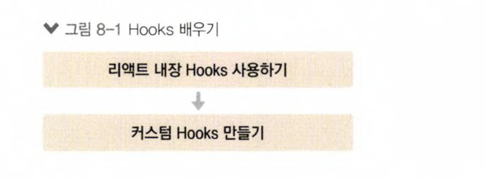

# react_hooks_tutorials
- Hooks
    - 리액트 V16.8에 새로 도입된 기능
    - 렌더링 직후 작업을 설정하는 useEffect 등의 기능 제공
    
    
    - [x] useState
    - [x] useEffect
    - [x] useReducer
    - [x] useMemo
    - [x] useCallback
    - [x] useRef
    - [x] Customized Hooks

    
## Getting Started with Create React App

This project was bootstrapped with [Create React App](https://github.com/facebook/create-react-app).

## Available Scripts

In the project directory, you can run:

### `yarn start`

Runs the app in the development mode.\
Open [http://localhost:3000](http://localhost:3000) to view it in the browser.

The page will reload if you make edits.\
You will also see any lint errors in the console.

