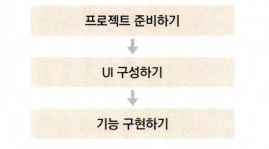

# todoapp_react_tutorials

- 일정 관리 애플리케이션

     
    
      

  - [x] UI 구성
    - TodoTemplate
    - TodoInsert
    - TodoList
    - TodoListItem
  - [x] 기능 구현
    - 기존 todolist 보여주기 기능
    - 새로운 todo 추가 기능
    - 지우기 기능
    - 수정 기능

## Available Scripts

In the project directory, you can run:

### `yarn start`

Runs the app in the development mode.\
Open [http://localhost:3000](http://localhost:3000) to view it in the browser.

The page will reload if you make edits.\
You will also see any lint errors in the console.
