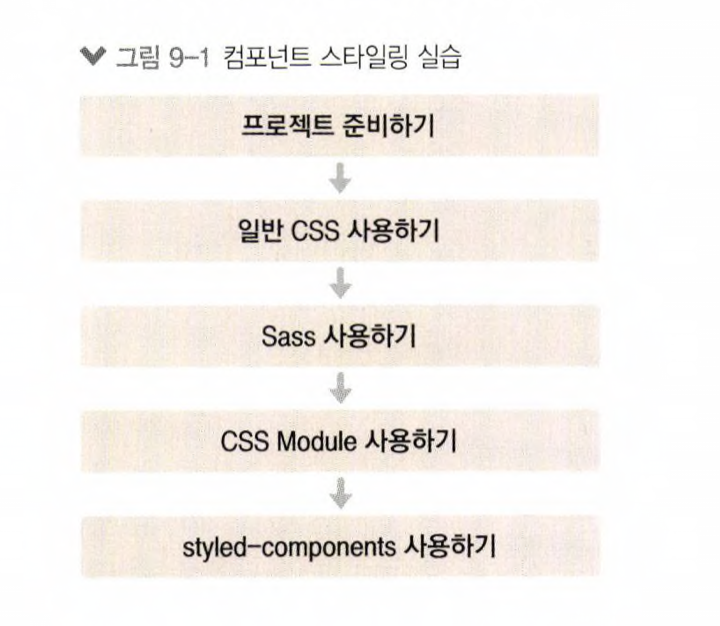

# styling_react_tutorials
- Component Styling
    - 리액트에서는 여러 가지 방식으로 컴포넌트를 스타일링 할 수 있습니다.
    
    
    - [x] 일반 CSS
    - [x] Sass
    - [x] CSS Module
    - [x] styled- components
    

## Available Scripts

In the project directory, you can run:

### `yarn start`

Runs the app in the development mode.\
Open [http://localhost:3000](http://localhost:3000) to view it in the browser.

The page will reload if you make edits.\
You will also see any lint errors in the console.
