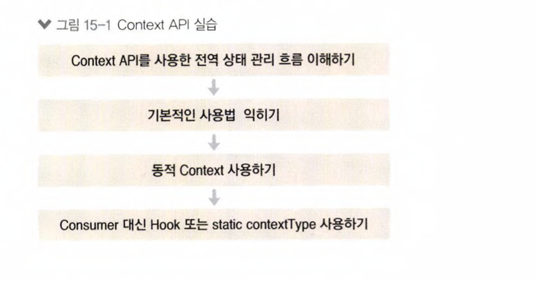

# context_react_tutorial

- Using Context API

     
    
      

  - [x] Context API를 사용한 전역 상태 관리 흐름 이해하기
  - [x] 동적 Context 사용하기

## Available Scripts

In the project directory, you can run:

### `yarn start`

Runs the app in the development mode.\
Open [http://localhost:3000](http://localhost:3000) to view it in the browser.

The page will reload if you make edits.\
You will also see any lint errors in the console.
