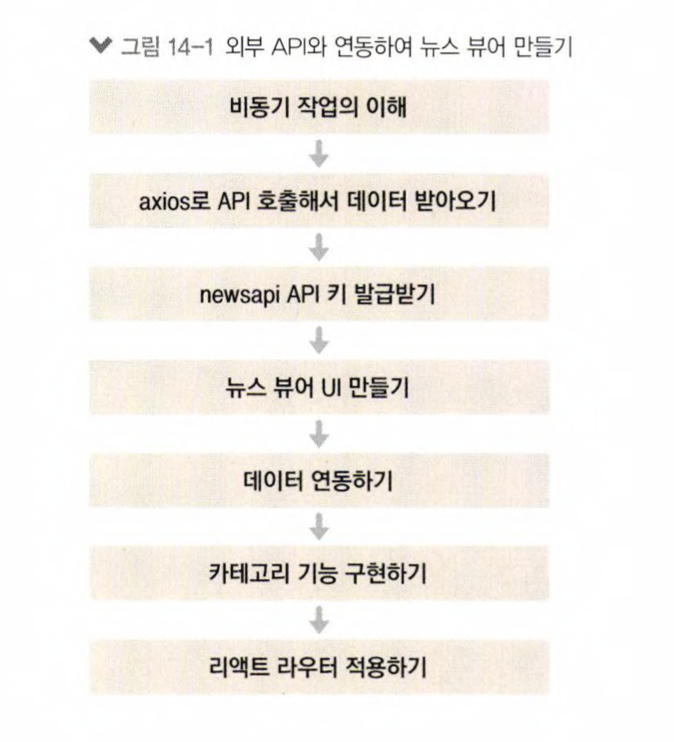

# news_viewer_react_tutorial

- 카테고리별로 최신 뉴스 목록을 보여 주는 뉴스 뷰어 프로젝트
- https://newsapi.org/에서 제공하는 API를 사용하여 데이터를 받아옴
- styled-components를 활용해 프로젝트 스타일링
- API 키는 https://newsapi.org/register에 가입하면 발급받을 수 있음

     
    
      

  - [x] ## UI 구성
    - NewsItem => 각 뉴스 정보를 보여 주는 컴포넌트
    - NewsList => API를 요청하고 뉴스 데이터가 들어 있는 배열을 컴포넌트 배열로 번환하여 렌더링해주는 컴포넌트
  - [x] ## 기능 구현
    - 전체 뉴스 불러오기
    - 카테고리 별로 뉴스 리스트 불러오기
    - 각 뉴스 url로 연결

## Available Scripts

In the project directory, you can run:

### `yarn start`

Runs the app in the development mode.\
Open [http://localhost:3000](http://localhost:3000) to view it in the browser.

The page will reload if you make edits.\
You will also see any lint errors in the console.
