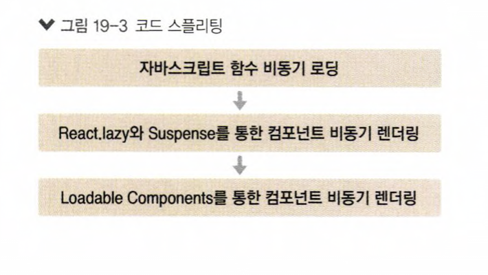

# react_splitting_sample_tutorial

- 리액트 프로젝트 빌드 작업 후 배포

  - webpack 도구 이용
  - CRA로 프로젝트를 빌드해보기
  - 파일을 분리하는 작업 => 코드 스플리팅
  - 코드 비동기 로딩을 통해 자바스크립트 함수, 객체, 흑은 컴포넌트를 처음에는 불러오지 않고 필요한 시점에 불러와서 사용할 수 있음

     
    
      

## Available Scripts

In the project directory, you can run:

### `yarn start`

Runs the app in the development mode.\
Open [http://localhost:3000](http://localhost:3000) to view it in the browser.

The page will reload if you make edits.\
You will also see any lint errors in the console.
