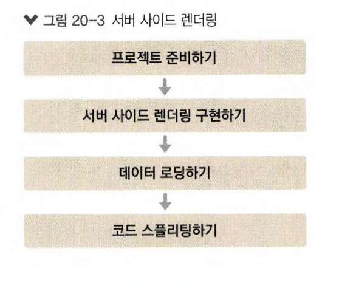

# react_ssr_recipe_tutorial

- 서버 사이드 렌더링(SSR)

  - UI를 서버에서 렌더링하는 것을 의미

     
    
      

## Available Scripts

In the project directory, you can run:

### `yarn start`

Runs the app in the development mode.\
Open [http://localhost:3000](http://localhost:3000) to view it in the browser.

The page will reload if you make edits.\
You will also see any lint errors in the console.
