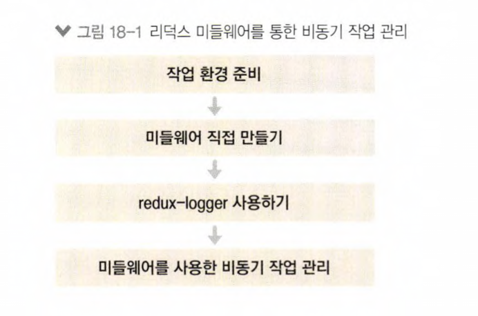

# redux_middleware_react_tutorial

- Redux middleware

  - 비동기 작업을 관리할 때 미들웨어를 사용하면 매우 효율적이고 편하게 상태 관리 가능
  - 미들웨어를 사용하여 비동기 작업을 처리하는 방법을 배워보자

     
    
      

  - [x] [UI](./src/components/)
  - [x] [Redux modules](./src/modules/)
  - [x] [Container_Component](./src/containers/)
  - [x] [lib] (./src/lib/)

## Available Scripts

In the project directory, you can run:

### `yarn start`

Runs the app in the development mode.\
Open [http://localhost:3000](http://localhost:3000) to view it in the browser.

The page will reload if you make edits.\
You will also see any lint errors in the console.
